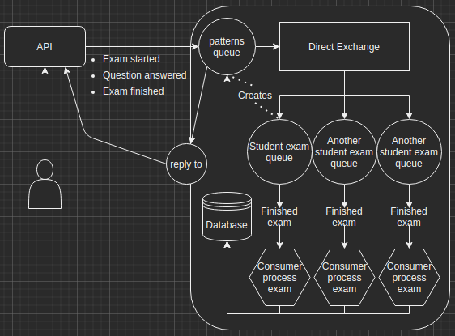

# rust-amqp-student-exam



---
## Rust AMQP
1. Change directory.
```
cd rust-amqp
```
2. Database migrations.
```
cargo run --bin migrations
```
3. Seed database with development data.
```
cargo run --bin seed
```
4. Run.
```
cargo run --bin main
```
## Rust API
1. Change directory.
```
cd rust-api
```
2. Run
```
cargo run
```
## Curl
1. Start exam.
```
curl --request POST \
--url localhost:4001/v1/exam/1/start \
--header 'content-type: application/json' \
| json_pp
```
2. Answer questions.
```
curl --request POST \
--url localhost:4001/v1/exam/1/question/1/answer/1 \
--header 'content-type: application/json' \
| json_pp

curl --request POST \
--url localhost:4001/v1/exam/1/question/2/answer/9 \
--header 'content-type: application/json' \
| json_pp
```
3. Finish exam.
```
curl --request POST \
--url localhost:4001/v1/exam/1/finish \
--header 'content-type: application/json' \
| json_pp
```

## RabbitMQ
### [Queue manager.](http://localhost:15672/)
- Login: guest
- Password: guest

## Nestjs API
1. Install.
```
yarn
# or
npm install
```
2. Start.
```
yarn start
# or
npm run start
```